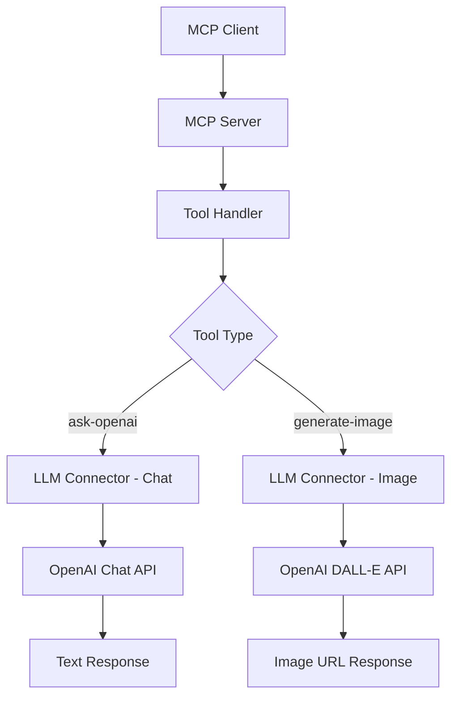

# Design Document

## Overview

This design extends the existing OpenAI MCP server to include DALL-E image generation capabilities. The implementation will add a new tool called "generate-image" that leverages OpenAI's DALL-E models to create images from text prompts and return the generated image URLs.

## Architecture

The image generation feature will integrate seamlessly with the existing MCP server architecture:



## Components and Interfaces

### 1. Enhanced LLMConnector Class

The existing `LLMConnector` class will be extended with a new method:

```python
async def generate_image(
    self, 
    prompt: str, 
    model: str = "dall-e-3", 
    size: str = "1024x1024", 
    quality: str = "standard",
    n: int = 1
) -> str
```

**Parameters:**
- `prompt`: Text description for image generation
- `model`: DALL-E model version ("dall-e-2" or "dall-e-3")
- `size`: Image dimensions ("256x256", "512x512", "1024x1024", "1024x1792", "1792x1024")
- `quality`: Image quality ("standard" or "hd" for DALL-E 3)
- `n`: Number of images to generate (1-10 for DALL-E 2, 1 for DALL-E 3)

### 2. New Tool Definition

A new tool will be added to the server's tool list:

```python
types.Tool(
    name="generate-image",
    description="Generate images using OpenAI DALL-E models",
    inputSchema={
        "type": "object",
        "properties": {
            "prompt": {"type": "string", "description": "Text description for image generation"},
            "model": {"type": "string", "default": "dall-e-3", "enum": ["dall-e-2", "dall-e-3"]},
            "size": {"type": "string", "default": "1024x1024", "enum": ["256x256", "512x512", "1024x1024", "1024x1792", "1792x1024"]},
            "quality": {"type": "string", "default": "standard", "enum": ["standard", "hd"]},
            "n": {"type": "integer", "default": 1, "minimum": 1, "maximum": 10}
        },
        "required": ["prompt"]
    }
)
```

### 3. Tool Handler Extension

The existing `handle_tool_call` function will be extended to handle the new "generate-image" tool:

```python
elif name == "generate-image":
    image_url = await connector.generate_image(
        prompt=arguments["prompt"],
        model=arguments.get("model", "dall-e-3"),
        size=arguments.get("size", "1024x1024"),
        quality=arguments.get("quality", "standard"),
        n=arguments.get("n", 1)
    )
    return [types.TextContent(type="text", text=f"Generated Image URL:\n{image_url}")]
```

## Data Models

### Input Validation

The system will validate:
- **Prompt**: Non-empty string, maximum 4000 characters for DALL-E 3, 1000 for DALL-E 2
- **Model**: Must be one of the supported DALL-E models
- **Size**: Must be a valid dimension combination for the selected model
- **Quality**: Only applicable to DALL-E 3 ("standard" or "hd")
- **N**: Must be 1 for DALL-E 3, 1-10 for DALL-E 2

### Response Format

The response will contain:
- Success case: Image URL(s) as plain text
- Error case: Descriptive error message with context

## Error Handling

### 1. Input Validation Errors
- Invalid model selection
- Unsupported size for selected model
- Empty or overly long prompts
- Invalid parameter combinations

### 2. API Errors
- Authentication failures
- Rate limiting
- Content policy violations
- Network timeouts
- Service unavailability

### 3. Error Response Format
All errors will be returned as `TextContent` with descriptive messages:
```python
return [types.TextContent(type="text", text=f"Error: {error_description}")]
```

## Testing Strategy

### 1. Unit Tests
- Test `generate_image` method with various parameter combinations
- Test input validation logic
- Test error handling for different failure scenarios
- Mock OpenAI API responses for consistent testing

### 2. Integration Tests
- Test complete tool call flow from MCP client to OpenAI API
- Test tool discovery and schema validation
- Test error propagation through the MCP protocol

### 3. Manual Testing
- Verify image generation with different models and parameters
- Test error scenarios (invalid API key, rate limits, etc.)
- Validate generated image URLs are accessible

## Implementation Considerations

### 1. Model Compatibility
- DALL-E 2: Supports multiple images (n=1-10), limited sizes
- DALL-E 3: Single image only (n=1), more size options, quality parameter

### 2. Cost Management
- DALL-E 3 is more expensive than DALL-E 2
- HD quality images cost more than standard quality
- Consider logging usage for cost tracking

### 3. Content Policy
- OpenAI has content policies for image generation
- API will reject prompts that violate policies
- Error messages should be informative but not expose policy details

### 4. Response Time
- Image generation can take 10-60 seconds
- Consider implementing timeout handling
- Provide appropriate user feedback for long operations